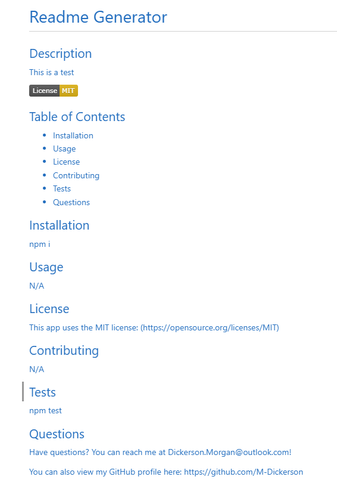

# Readme Generator

## Description

The motivation and purpose behind this project was to create an index.js file that can generate a readme through a series of prompts. It solves the issue of not being able to easily generate a readme locally through our machines. I learned about node and how to properly install it, as well as creating a toggle menu through node.

## Table of Contents
- [Installation](#installation)
- [Usage](#usage)
- [Credits](#credits)
- [License](#license)

## Installation

Node and Inquirer MUST be installed!

## Usage
[Link to demo video](https://drive.google.com/file/d/1tuISch59zyoddEUoQgGHJMjW-LPjIsjY/view)

## Credits

[Inquirer 8.2.4](https://www.npmjs.com/package/inquirer/v/8.2.4)

[Node](https://nodejs.org/en/)

## License

MIT License

A short and simple permissive license with conditions only requiring preservation of copyright and license notices. Licensed works, modifications, and larger works may be distributed under different terms and without source code.